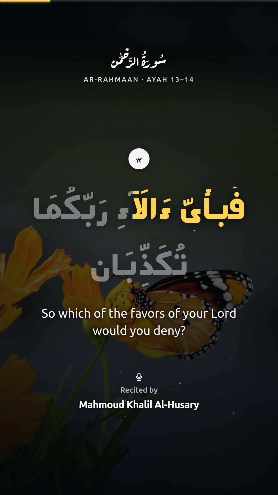
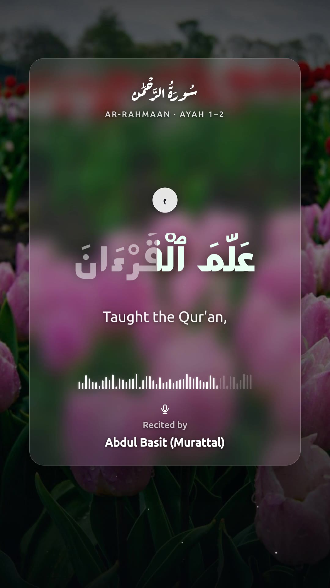
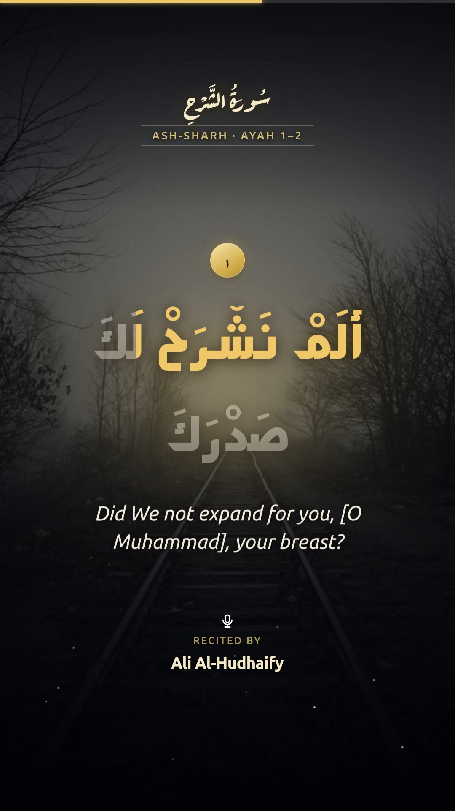
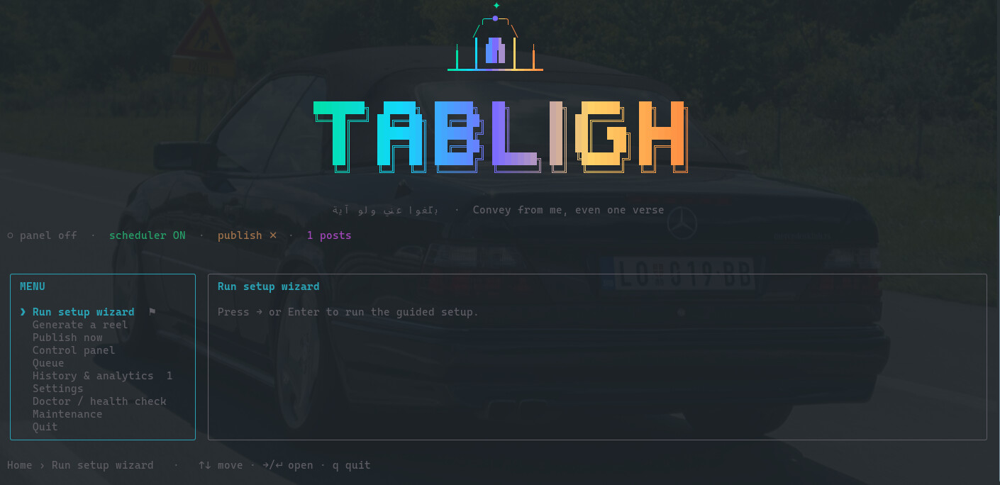

<div align="center">


# 🕌 Tabligh

### بَلِّغُوا عَنِّي وَلَوْ آيَةً
_"Transmitid de mí, aunque sea un solo versículo."_ — Profeta Mahoma ﷺ (Bujari)

**Genera automáticamente reels coránicos cinematográficos, sincronizados al estilo karaoke, y publícalos en TikTok, Instagram, Facebook y YouTube — de forma programada y sin intervención manual.**

No elijas nada. Un programador escoge una sura y un pasaje al azar, obtiene la recitación exacta, renderiza un vídeo vertical con resaltado palabra por palabra sobre un fondo sereno, y lo publica varias veces al día.

[](LICENSE)
[](package.json)
[](tsconfig.json)

🌍 [English](README.md) · [العربية](README.ar.md) · [Français](README.fr.md) · [اردو](README.ur.md) · [Bahasa Indonesia](README.id.md) · [Türkçe](README.tr.md) · [Bahasa Melayu](README.ms.md) · [বাংলা](README.bn.md) · [فارسی](README.fa.md) · [Español](README.es.md)

**▶ Míralo en vivo:** [@eQurany en TikTok](https://www.tiktok.com/@eQurany) — cada vídeo allí es generado automáticamente por este proyecto.

<table>
  <tr>
    <td align="center"><b>classic</b></td>
    <td align="center"><b>glass</b></td>
    <td align="center"><b>noor</b></td>
  </tr>
  <tr>
    <td></td>
    <td></td>
    <td></td>
  </tr>
  <tr>
    <td align="center"><sub>foto + velo · karaoke dorado<br/><i>Al-Husary</i></sub></td>
    <td align="center"><sub>una tarjeta esmerilada · forma de onda en vivo<br/><i>Al-Tunaiji · con basmala</i></sub></td>
    <td align="center"><sub>halo dorado · numerales dorados<br/><i>Al-Minshawi · con basmala</i></sub></td>
  </tr>
</table>

<sub>Tres plantillas integradas — cámbialas con <code>TEMPLATE</code> o en el panel/menú. Cada reel varía su fondo, y <code>glass</code> recibe una forma de onda única por vídeo.</sub>

</div>

---

## ✨ Características

- 🎬 **Reels cinematográficos de 1080×1920** — fondo de foto de archivo a sangre completa (Pexels/Unsplash) con una capa superpuesta que garantiza gran legibilidad, sutiles partículas a la deriva, y un lento desplazamiento estilo Ken-Burns.
- 🎨 **Tres plantillas visuales** — **classic** (foto + velo), **glass** (una tarjeta persistente de glassmorphism esmerilada con una forma de onda de audio en vivo), y **noor** (cálida "Luz Divina" — halo dorado + numerales dorados). Configura `TEMPLATE` o cámbiala en el panel/menú.
- 🕋 **Introducción Bismillah** — un pasaje que comienza en la aya 1 siempre abre con el propio Bismillah del recitador (recitado, en su voz); opcionalmente puedes anteponerlo antes de *cada* pasaje (`BASMALA=always`). At-Tawbah y Al-Fatiha se gestionan correctamente.
- 🎤 **Relleno de palabras estilo karaoke** — cada palabra se ilumina en sincronía con la recitación (derecha→izquierda), para que los espectadores puedan seguirla.
- 🖋️ **Tipografía árabe auténtica** — texto uthmaní completo con el *shakl* correcto en la limpia y moderna fuente **Mada**; encabezados en caligrafía **Aref Ruqaa**.
- 🎯 **Sincronización exacta, cero IA** — el audio proviene de [everyayah.com](https://everyayah.com) como archivos por aya, de modo que la sincronización de cada aya es exacta y gratuita (sin transcripción).
- 🔀 **Selección automática de contenido** — sura al azar + un pasaje consecutivo al azar (longitud configurable); las suras cortas se renderizan completas.
- 🌇 **Fondos seguros y de buen gusto** — un conjunto curado de 50 palabras clave (mezquitas, naturaleza, mar, cielo…) más un filtro que descarta cualquier foto que contenga personas o algo inadecuado. Elige tu fuente: **Pexels, Unsplash, o tu propia carpeta de imágenes local**.
- 🖥️ **Centro de mando interactivo** — ejecuta `tabligh` (sin argumentos) para una impresionante interfaz de terminal donde generar reels, iniciar/detener el panel, gestionar la cola, explorar el historial, editar la configuración, y ejecutar una comprobación de estado. Localizado en EN/AR/FR.
- 🎞️ **Cierre distintivo** — el pasaje se desvanece y una ṣalawāt (con tu logotipo) se desliza hacia arriba sobre la misma escena, y luego todo el vídeo se funde a negro.
- 📤 **Publicación multiplataforma** — TikTok, Instagram Reels, Facebook Reels y YouTube Shorts a través de [Buffer](https://buffer.com), activable por plataforma mediante variables de entorno.
- 🎛️ **Panel de control autoalojado** — una interfaz web protegida con contraseña para gestionar cada ajuste, generar/previsualizar/publicar un reel, poner pasajes en cola, y explorar el historial + analíticas — todo en vivo, sin volver a desplegar. Localizado (EN/AR/FR, RTL completo).
- ⏰ **Programador de configúralo y olvídate** — un proceso siempre activo publica N veces al día en tu zona horaria.
- 🧹 **Ligero con el disco** — los archivos locales se borran justo después de publicar; los objetos en la nube se eliminan automáticamente.
- 🐳 **Despliegue en un solo contenedor** — Dockerfile + funciona de maravilla en Coolify, Fly, Railway, o cualquier host de Docker.

---

## 🧠 Cómo funciona

```
config / random pick
        │
        ▼
Quran text + translation  ──►  everyayah per-ayah audio (exact timing)
   (alquran.cloud)                       │
        │                                ▼
        └────────────►  TimedAyah[]  ──►  background (Pexels/Unsplash, person-filtered)
                                          │
                                          ▼
              Chromium renders animated frames (karaoke, particles, outro)
                                          │
                                          ▼
                    ffmpeg → MP4 (1080×1920) + recitation + silent outro
                                          │
                                          ▼
              object storage (public URL)  ──►  Buffer  ──►  TikTok / IG / FB / YT
                                          │
                                          ▼
                              cleanup (local now, cloud after ingest)
```

---

## 🚀 Inicio rápido (local)

Requisitos: **Node ≥ 20** y **ffmpeg** en tu PATH. (Chromium se descarga automáticamente por Puppeteer.)

```bash
git clone https://github.com/911RS/tabligh.git
cd tabligh
npm install
cp .env.example .env        # fill in what you need (see below)

# Render a specific passage to work/…/reel.mp4 (no publishing)
npm start render -- --surah 112 --from 1 --to 4 --reciter husary --translation en.sahih

# Render a random passage
npm start random

# Everything the CLI can do
npm start
```

El `reel.mp4` terminado (junto con el `ir.json` sincronizado) aparece en `work/<surah>_<range>_<reciter>__<tag>/`.

---

## ⚙️ Configuración

Todo se controla mediante variables de entorno (`.env`). Todas son opcionales salvo cuando una función necesita una clave.

| Variable | Propósito | Valor por defecto |
|---|---|---|
| `TEMPLATE` | Estilo visual del reel: `classic` / `glass` / `noor` | `classic` |
| `BASMALA` | Introducción Bismillah: `off` (solo en la aya 1) / `always` (cada pasaje) | `off` |
| `BACKGROUND_SOURCE` | `auto` / `pexels` / `unsplash` / `local` | `auto` |
| `BACKGROUND_LOCAL_DIR` | Carpeta con tus propias imágenes en vertical (cuando la fuente = `local`) | _(vacío)_ |
| `PEXELS_API_KEY` / `UNSPLASH_ACCESS_KEY` | Fondos de fotos de archivo | _(sin definir → degradado de reserva)_ |
| `BUFFER_ACCESS_TOKEN` | Token de la API de Buffer para publicar | _(sin definir → no se publica)_ |
| `BUFFER_TIKTOK_CHANNEL_IDS` | IDs de canales de TikTok separados por comas | _(vacío)_ |
| `BUFFER_INSTAGRAM_CHANNEL_IDS` | IDs de canales de Instagram Reels | _(vacío)_ |
| `BUFFER_FACEBOOK_CHANNEL_IDS` | IDs de canales de Facebook Reels | _(vacío)_ |
| `BUFFER_YOUTUBE_CHANNEL_IDS` | IDs de canales de YouTube Shorts | _(vacío)_ |
| `MINIO_*` | Almacenamiento compatible con S3 (bucket público del que Buffer obtiene) | bucket `tabligh`, puerto `9000` |
| `TZ` / `PUBLISH_TIMES` | Zona horaria + horas del día para publicar automáticamente | `Africa/Tunis` / `07:00,13:00,19:00` |
| `KARAOKE_ENABLED` | Relleno palabra por palabra sincronizado con la recitación | `true` |
| `TEXT_FILL_COLOR` | Color del texto recitado (rellenado) | `#ffffff` |
| `WATERMARK_ENABLED` / `WATERMARK_HANDLE` | Marca de agua con logotipo en la esquina (`assets/logo.png`) | `true` / _(vacío)_ |
| `OUTRO_TEXT` | Texto de despedida del cierre | una ṣalawāt |
| `FULL_SURAH_MAX_AYAHS` | Suras de esta longitud o menor se renderizan completas | `7` |
| `RANDOM_MIN_AYAHS` / `RANDOM_MAX_AYAHS` | Longitud del pasaje para el modo aleatorio | `5` / `10` |
| `MAX_VIDEO_SECONDS` | Limita la longitud de la recitación (sin contar el cierre); recorta las ayas finales para ajustarse (anula el mínimo) | `0` _(sin límite)_ |
| `RETENTION_DAYS` / `MINIO_RETENTION_HOURS` | Ventanas de limpieza | `7` días / `24` h |
| `PORT` / `TRIGGER_TOKEN` | Servidor HTTP + secreto para el endpoint de activación | `1998` / _(sin definir → deshabilitado)_ |
| `PANEL_ENABLED` | Servir el panel de control (`false` = sin interfaz, solo programador) | `true` |
| `UI_LANG` | Idioma del menú interactivo de terminal (`en` / `ar` / `fr`) | `en` |

Consulta [`.env.example`](.env.example) para la lista completa y anotada. **Estos valores solo inicializan el almacén en la primera ejecución** — después de eso, gestiona los ajustes en vivo en el panel o en el menú `tabligh`.

**Recitadores:** `husary`, `minshawy`, `abdulbasit`, `hudhaify`, `ayyoub`, `shuraym`, `husary-muallim`, `tunaiji` — o cualquier carpeta directa de [everyayah](https://everyayah.com). Consulta [`src/quran/reciters.ts`](src/quran/reciters.ts).

**Traducciones:** cualquier id de edición de [alquran.cloud](https://alquran.cloud), por ejemplo `en.sahih`, `fr.hamidullah`, o `""` para solo árabe.

---

## 🖥️ Centro de mando interactivo

Ejecuta **`tabligh`** sin argumentos en una terminal para abrir el menú interactivo — un centro de control autónomo para todo:

<div align="center">
  
</div>

```
tabligh                 # opens the menu (in a TTY)
```

- **Generar un reel** — al azar o eligiendo un pasaje; se renderiza localmente (con progreso en vivo), y luego ofrece abrir el vídeo o publicarlo.
- **Publicar ahora** — generar + publicar en un solo paso.
- **Panel de control** — **Iniciar / Detener / Reiniciar** el panel web como servicio en segundo plano, **abrirlo** en tu navegador, o **seguir sus registros** — sin ningún proceso separado que vigilar.
- **Cola** — añadir/eliminar pasajes que el programador reproduce antes de las selecciones aleatorias.
- **Historial y analíticas** — totales, desglose por plataforma, publicaciones recientes.
- **Ajustes** — idioma, fuente de fondos (incl. carpeta local), programador activado/desactivado, horario, contenido, canales, y claves de API — todo aplicado en vivo.
- **Doctor** — comprobación de estado de un vistazo (ffmpeg, Chrome, claves, almacenamiento, disco).

Localizado en **English / العربية / Français** (configura `UI_LANG` o cámbialo en Ajustes). Los contextos no interactivos (tuberías, Docker, CI) muestran la ayuda clásica en su lugar, de modo que la creación de scripts no se ve afectada. También existe `tabligh menu` (forzarlo) y `tabligh doctor` (ejecutar solo la comprobación de estado).

## 🎛️ Panel de control web y CLI

Abre la raíz de la aplicación (`http://localhost:1998`) para un panel protegido con contraseña:

- **La primera ejecución** muestra una pantalla de configuración para crear tu contraseña (o ejecuta `tabligh init` para un asistente de terminal — ahora termina mostrando la URL de tu panel y ofreciéndote iniciar el panel).
- **Panel principal** — estado, *Generar ahora* / *+ publicar* con un solo clic, última vista previa.
- **Generar** — elige un pasaje o ve al azar, previsualiza antes de que se publique.
- **Ajustes** — horario (zona horaria + selector de hora), contenido (traducción, número de ayas, **longitud máxima**), marca (karaoke, color de relleno, partículas, fondo animado, promoción del cierre), ids de canales de plataformas, claves de API y almacenamiento — aplicados **en vivo**.
- **Cola** — planifica pasajes específicos; el programador los reproduce antes de las selecciones aleatorias.
- **Historial / Analíticas** — cada renderizado + publicación, totales, por plataforma, registros recientes.
- **Idioma** — cambia el panel entre English, العربية (RTL) y Français.

El inicio de sesión tiene límite de intentos (5 intentos → bloqueo de 15 min). Restablece la contraseña desde el servidor con
`tabligh set-password <new>` (por ejemplo `docker exec <container> tabligh set-password …`).

Los ajustes viven en el almacén y persisten en el volumen `/app/data`; `.env` solo los inicializa en la primera ejecución.

### 🌐 Acceso al panel

La aplicación no tiene un dominio propio — simplemente escucha en un puerto (**`1998`** por defecto, anúlalo con `PORT`) en todas las interfaces. La URL que abras depende de dónde se ejecute:

| Dónde se ejecuta | URL que abres | ¿HTTPS? |
|---|---|---|
| Tu propio ordenador (`npm` / local) | `http://localhost:1998` | — (local, está bien) |
| VPS en la nube, puerto expuesto directamente | `http://<your-server-ip>:1998` | ❌ **no** |
| VPS detrás de un proxy inverso | `https://yourdomain.com` | ✅ el proxy lo provee |

- **Localmente**, el asistente de configuración imprime el enlace exacto al iniciar (`http://localhost:1998`).
- **En un VPS**, alcanzar `http://<server-ip>:1998` también requiere que tu firewall / grupo de seguridad permita el tráfico entrante en `1998`.
- **⚠️ No dejes el puerto expuesto directamente a internet.** El panel sirve HTTP plano, por lo que tu contraseña de inicio de sesión viajaría sin cifrar. Ponlo detrás de un proxy inverso que termine el TLS:
  - **[Coolify](https://coolify.io)** (recomendado) — asigna un dominio a la aplicación y apúntalo al puerto `1998`; el Traefik de Coolify gestiona el enrutamiento **y** un certificado de Let's Encrypt automáticamente.
  - **Nginx / Caddy** — `proxy_pass http://127.0.0.1:1998` detrás de tu dominio + certificado.

La aplicación nunca necesita conocer su dominio público; el proxy es dueño del dominio y del HTTPS y reenvía a `1998` internamente.

---

## 📤 Publicación

La publicación pasa por [Buffer](https://buffer.com), que la distribuye a cada plataforma conectada.

1. Crea una cuenta de Buffer y conecta tus canales de TikTok / Instagram / Facebook / YouTube.
2. Configura `BUFFER_ACCESS_TOKEN`, luego ejecuta `npm start channels` para listar los ids de tus canales.
3. Coloca los ids en las variables `BUFFER_*_CHANNEL_IDS` correspondientes (cualquier subconjunto — solo TikTok está bien).
4. `npm start random -- --publish` (o deja que el programador lo haga).

Cada plataforma recibe el formato correcto automáticamente (Reel / Short). El pie de texto incluye la sura, el rango de ayas, el recitador, el crédito de la foto, y los hashtags.

### Almacenamiento — no necesitas instalar MinIO

El almacenamiento de objetos se usa **solo para publicar**: el reel se sube a un bucket de S3 para que los servidores de Buffer puedan obtenerlo desde una **URL pública**. Si solo renderizas localmente (sin publicar), no necesitas **ningún almacenamiento en absoluto**.

Los ajustes `MINIO_*` son simplemente credenciales **estándar de S3** — cualquier proveedor compatible con S3 funciona, no solo MinIO:

| Proveedor | ¿Instalar? | Notas |
|---|---|---|
| **Cloudflare R2** | ❌ | Nivel gratuito + buckets públicos — el más fácil |
| **AWS S3 / Backblaze B2 / Wasabi / DO Spaces** | ❌ | Bucket en la nube + claves de acceso |
| **MinIO autoalojado** | ✅ | Solo vale la pena en un servidor con un dominio público |

⚠️ **Advertencia local:** Buffer obtiene los archivos a través de internet público, por lo que la `MINIO_PUBLIC_URL` del bucket debe ser accesible desde fuera de tu máquina. Un MinIO en `localhost`/tu LAN **no** funcionará (Buffer no puede alcanzarlo) — usa un bucket en la nube, o aloja MinIO detrás de un dominio público (por ejemplo, en la misma máquina que tu panel). La aplicación crea automáticamente el bucket y establece una política de lectura pública en la primera publicación, y elimina los objetos antiguos después de `MINIO_RETENTION_HOURS`.

---

## 🐳 Despliegue (programador siempre activo + panel de control)

Un solo comando — persistencia incluida, nada que configurar:

```bash
cp .env.example .env      # fill in your keys (optional — you can also do it in the panel)
docker compose up -d      # scheduler + control panel, on http://localhost:1998
```

Eso es todo. En el primer arranque la aplicación **crea su propio almacén de configuración** en `data/store.json`
(inicializado desde tu `.env`) — nunca creas ni "vinculas" nada. El
`docker-compose.yml` incluido monta un volumen con nombre en `/app/data`, de modo que tus ajustes, la contraseña del panel,
la cola y el historial **persisten a través de reinicios y reconstrucciones** automáticamente.

`serve` (el comando por defecto) inicia:
- un **panel de control** en `/` — protegido con contraseña; gestiona los ajustes, genera/previsualiza un
  reel, publica ahora, explora el historial/analíticas, y pon pasajes en cola. Cambia cualquier cosa en vivo,
  sin volver a desplegar.
- un **programador interno** que renderiza + publica en cada `PUBLISH_TIMES` en tu `TZ`;
- `GET /health` y un `GET /trigger?key=<TRIGGER_TOKEN>` protegido con token para scripting.

**Modo sin interfaz:** ejecuta `tabligh serve --no-panel` (o configura `PANEL_ENABLED=false`) para mantener el
programador publicando mientras no expone **ninguna superficie HTTP en absoluto** — ideal si solo gestionas la aplicación
desde la terminal (menú `tabligh`) y no quieres un panel web que asegurar.

**La configuración vive en el almacén después del primer arranque** (para que el panel pueda editarla en vivo). `.env` solo la
*inicializa* una vez — para cambiar cosas más tarde, usa el panel (o `tabligh set-password` para restablecer
la contraseña). Elimina `data/store.json` para reinicializar desde `.env`.

**En Coolify / Railway / Fly:** apúntalo a este repositorio. Si despliegas el **`docker-compose.yml`**,
el volumen se crea por ti — cero pasos manuales. Si usas el **Dockerfile** simple, la
línea `VOLUME /app/data` hace que la mayoría de plataformas lo persistan automáticamente; en Coolify también puedes
añadir un Almacenamiento Persistente montado en `/app/data`. Configura tus variables de entorno y despliega.

¿Primera ejecución sin CLI? Simplemente abre el panel — muestra una **pantalla de configuración** para crear tu
contraseña. ¿Prefieres la terminal? Ejecuta **`tabligh init`** para un asistente interactivo.

---

## 🗺️ Hoja de ruta

- [ ] Modo con fuente de YouTube (yt-dlp + Whisper) para recitaciones arbitrarias
- [ ] Karaoke con alineación forzada real (con precisión de palabra) mediante los segmentos de Quran.com
- [ ] Registro de deduplicación para que los pasajes no se repitan hasta que se recorra todo el Mushaf
- [ ] Más disposiciones / temas

---

## 🙏 Créditos

- Recitaciones: **[everyayah.com](https://everyayah.com)** · Texto y traducciones: **[alquran.cloud](https://alquran.cloud)**
- Fondos: **[Pexels](https://pexels.com)** / **[Unsplash](https://unsplash.com)** (acreditados en cada pie de texto)
- Fuentes: **Mada** (cuerpo de la aya), **Aref Ruqaa** (encabezados), **Reem Kufi** (cierre), **Ubuntu** (interfaz) (SIL OFL / UFL)
- Renderizado: **Puppeteer** + **ffmpeg**

## 📜 Licencia

[MIT](LICENSE) — haz el bien con ello. Por favor, mantén las recitaciones y el texto coránico presentados con respeto.

<div align="center">

_Si esto te ayuda a difundir una buena palabra, dale ⭐ al repositorio y echa un vistazo a **[@eQurany](https://www.tiktok.com/@eQurany)**._

</div>
