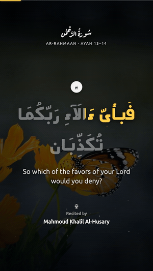
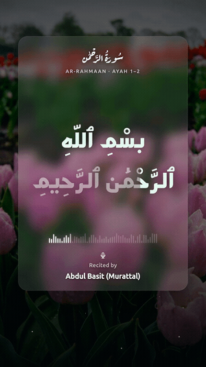
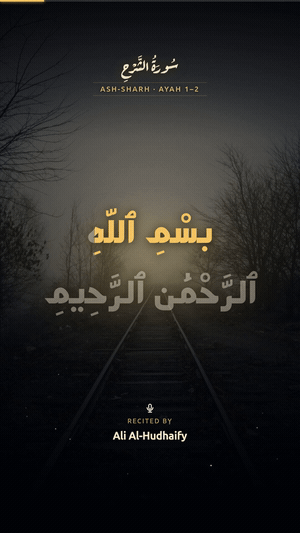

<div align="center">


# 🕌 Tabligh

### بَلِّغُوا عَنِّي وَلَوْ آيَةً
_« Transmettez de ma part, ne serait-ce qu'un seul verset. »_ — le Prophète Muhammad ﷺ (Boukhari)

**Générez automatiquement des reels coraniques cinématographiques, synchronisés en karaoké, et publiez-les sur TikTok, Instagram, Facebook et YouTube — selon un calendrier, sans intervention.**

Ne choisissez rien. Un planificateur sélectionne une sourate + un passage au hasard, récupère la récitation exacte, produit une vidéo verticale avec une mise en évidence mot par mot sur un fond apaisant, et la publie plusieurs fois par jour.

[](LICENSE)
[](package.json)
[](tsconfig.json)

🌍 [English](README.md) · [العربية](README.ar.md) · [Français](README.fr.md) · [اردو](README.ur.md) · [Bahasa Indonesia](README.id.md) · [Türkçe](README.tr.md) · [Bahasa Melayu](README.ms.md) · [বাংলা](README.bn.md) · [فارسی](README.fa.md) · [Español](README.es.md)

**▶ Voyez-le en direct :** [@eQurany sur TikTok](https://www.tiktok.com/@eQurany) — chaque vidéo là-bas est générée automatiquement par ce projet.

<table>
  <tr>
    <td align="center"><b>classic</b></td>
    <td align="center"><b>glass</b></td>
    <td align="center"><b>noor</b></td>
  </tr>
  <tr>
    <td></td>
    <td></td>
    <td></td>
  </tr>
  <tr>
    <td align="center"><sub>photo + voile · karaoké doré<br/><i>Al-Husary</i></sub></td>
    <td align="center"><sub>une carte givrée · forme d'onde en direct<br/><i>Al-Tunaiji · avec basmala</i></sub></td>
    <td align="center"><sub>halo doré · chiffres dorés<br/><i>Al-Minshawi · avec basmala</i></sub></td>
  </tr>
</table>

<sub><b>▶ Aperçu animé — en boucle</b></sub>

<table>
  <tr>
    <td align="center"><b>classic</b></td>
    <td align="center"><b>glass</b></td>
    <td align="center"><b>noor</b></td>
  </tr>
  <tr>
    <td></td>
    <td></td>
    <td></td>
  </tr>
</table>

<sub>Trois modèles intégrés — changez avec <code>TEMPLATE</code> ou depuis le panneau/menu. Chaque reel varie son arrière-plan, et <code>glass</code> obtient une forme d'onde unique par vidéo.</sub>

</div>

---

## ✨ Fonctionnalités

- 🎬 **Reels cinématographiques 1080×1920** — arrière-plan photo de banque d'images en plein cadre (Pexels/Unsplash) avec un fort calque de lisibilité, de subtiles particules dérivantes et un lent effet Ken Burns.
- 🎨 **Trois modèles visuels** — **classic** (photo + voile), **glass** (une carte givrée persistante en glassmorphisme avec une forme d'onde audio en direct) et **noor** (chaleureux « Lumière Divine » — halo doré + chiffres dorés). Définissez `TEMPLATE` ou changez-le depuis le panneau/menu.
- 🕋 **Intro Bismillah** — un passage qui commence à l'ayah 1 s'ouvre toujours avec le propre Bismillah du récitateur (récité, dans sa voix) ; ajoutez-le facultativement avant *chaque* passage (`BASMALA=always`). At-Tawbah et Al-Fatiha sont gérés correctement.
- 🎤 **Remplissage karaoké mot à mot** — chaque mot s'illumine en synchronisation avec la récitation (droite→gauche), pour que les spectateurs suivent.
- 🖋️ **Typographie arabe authentique** — texte othmanien complet avec le *shakl* correct dans la police moderne et épurée **Mada** ; en-têtes en calligraphie **Aref Ruqaa**.
- 🎯 **Synchronisation exacte, zéro IA** — l'audio provient de [everyayah.com](https://everyayah.com) sous forme de fichiers par ayah, de sorte que le minutage de chaque ayah est exact et gratuit (aucune transcription).
- 🔀 **Sélection automatique du contenu** — sourate aléatoire + un passage consécutif aléatoire (longueur configurable) ; les sourates courtes sont rendues en entier.
- 🌇 **Arrière-plans sûrs et élégants** — un pool soigné de 50 mots-clés (mosquées, nature, mer, ciel…) plus un filtre qui écarte toute photo contenant des personnes ou quoi que ce soit d'inapproprié. Choisissez votre source : **Pexels, Unsplash, ou votre propre dossier d'images local**.
- 🖥️ **Centre de commande interactif** — lancez `tabligh` (sans argument) pour une superbe interface terminal permettant de générer des reels, démarrer/arrêter le panneau, gérer la file d'attente, parcourir l'historique, modifier les paramètres et exécuter un contrôle de santé. Localisé EN/AR/FR.
- 🎞️ **Outro signature** — le passage s'estompe et une ṣalawāt (avec votre logo) glisse vers le haut sur la même scène, puis toute la vidéo s'assombrit jusqu'au noir.
- 📤 **Publication multi-plateformes** — TikTok, Instagram Reels, Facebook Reels et YouTube Shorts via [Buffer](https://buffer.com), activés par plateforme via les variables d'environnement.
- 🎛️ **Panneau de contrôle auto-hébergé** — une interface web protégée par mot de passe pour gérer chaque paramètre, générer/prévisualiser/publier un reel, mettre des passages en file d'attente et parcourir l'historique + les analyses — le tout en direct, sans redéploiement. Localisé (EN/AR/FR, RTL complet).
- ⏰ **Planificateur « configurez et oubliez »** — un processus toujours actif publie N fois par jour dans votre fuseau horaire.
- 🧹 **Économe en disque** — les fichiers locaux sont effacés juste après la publication ; les objets cloud sont élagués automatiquement.
- 🐳 **Déploiement en un conteneur** — Dockerfile + fonctionne parfaitement sur Coolify, Fly, Railway ou tout hôte Docker.

---

## 🧠 Comment ça marche

```
config / random pick
        │
        ▼
Quran text + translation  ──►  everyayah per-ayah audio (exact timing)
   (alquran.cloud)                       │
        │                                ▼
        └────────────►  TimedAyah[]  ──►  background (Pexels/Unsplash, person-filtered)
                                          │
                                          ▼
              Chromium renders animated frames (karaoke, particles, outro)
                                          │
                                          ▼
                    ffmpeg → MP4 (1080×1920) + recitation + silent outro
                                          │
                                          ▼
              object storage (public URL)  ──►  Buffer  ──►  TikTok / IG / FB / YT
                                          │
                                          ▼
                              cleanup (local now, cloud after ingest)
```

---

## 🚀 Démarrage rapide (local)

Prérequis : **Node ≥ 20** et **ffmpeg** dans votre PATH. (Chromium est téléchargé automatiquement par Puppeteer.)

```bash
git clone https://github.com/911RS/tabligh.git
cd tabligh
npm install
cp .env.example .env        # fill in what you need (see below)

# Render a specific passage to work/…/reel.mp4 (no publishing)
npm start render -- --surah 112 --from 1 --to 4 --reciter husary --translation en.sahih

# Render a random passage
npm start random

# Everything the CLI can do
npm start
```

Le `reel.mp4` terminé (ainsi que le fichier minuté `ir.json`) se retrouve dans `work/<surah>_<range>_<reciter>__<tag>/`.

---

## ⚙️ Configuration

Tout est piloté par des variables d'environnement (`.env`). Toutes sont facultatives, sauf lorsqu'une fonctionnalité nécessite une clé.

| Variable | Objet | Défaut |
|---|---|---|
| `TEMPLATE` | Style visuel du reel : `classic` / `glass` / `noor` | `classic` |
| `BASMALA` | Intro Bismillah : `off` (seulement à l'ayah 1) / `always` (chaque passage) | `off` |
| `BACKGROUND_SOURCE` | `auto` / `pexels` / `unsplash` / `local` | `auto` |
| `BACKGROUND_LOCAL_DIR` | Dossier de vos propres images en portrait (quand source = `local`) | _(vide)_ |
| `PEXELS_API_KEY` / `UNSPLASH_ACCESS_KEY` | Arrière-plans photo de banque d'images | _(non défini → dégradé de secours)_ |
| `BUFFER_ACCESS_TOKEN` | Jeton API Buffer pour la publication | _(non défini → pas de publication)_ |
| `BUFFER_TIKTOK_CHANNEL_IDS` | Identifiants de chaînes TikTok, séparés par des virgules | _(vide)_ |
| `BUFFER_INSTAGRAM_CHANNEL_IDS` | Identifiants de chaînes Instagram Reels | _(vide)_ |
| `BUFFER_FACEBOOK_CHANNEL_IDS` | Identifiants de chaînes Facebook Reels | _(vide)_ |
| `BUFFER_YOUTUBE_CHANNEL_IDS` | Identifiants de chaînes YouTube Shorts | _(vide)_ |
| `MINIO_*` | Stockage compatible S3 (bucket public où Buffer récupère) | bucket `tabligh`, port `9000` |
| `TZ` / `PUBLISH_TIMES` | Fuseau horaire + heures de la journée pour publier automatiquement | `Africa/Tunis` / `07:00,13:00,19:00` |
| `KARAOKE_ENABLED` | Remplissage mot à mot synchronisé avec la récitation | `true` |
| `TEXT_FILL_COLOR` | Couleur du texte récité (rempli) | `#ffffff` |
| `WATERMARK_ENABLED` / `WATERMARK_HANDLE` | Filigrane logo en coin (`assets/logo.png`) | `true` / _(vide)_ |
| `FULL_SURAH_MAX_AYAHS` | Les sourates aussi courtes sont rendues en entier | `7` |
| `RANDOM_MIN_AYAHS` / `RANDOM_MAX_AYAHS` | Longueur du passage en mode aléatoire | `5` / `10` |
| `MAX_VIDEO_SECONDS` | Plafonne la durée de récitation (hors outro) ; coupe les ayahs finaux pour tenir (prioritaire sur le minimum) | `0` _(sans limite)_ |
| `RETENTION_DAYS` / `MINIO_RETENTION_HOURS` | Fenêtres de nettoyage | `7` jours / `24` h |
| `PORT` / `TRIGGER_TOKEN` | Serveur HTTP + secret pour le point d'accès de déclenchement | `1998` / _(non défini → désactivé)_ |
| `PANEL_ENABLED` | Servir le panneau de contrôle (`false` = sans interface, planificateur seul) | `true` |
| `UI_LANG` | Langue du menu terminal interactif (`en` / `ar` / `fr`) | `en` |

Voir [`.env.example`](.env.example) pour la liste complète et annotée. **Ces valeurs n'initialisent le store qu'au premier lancement** — ensuite, gérez les paramètres en direct dans le panneau ou le menu `tabligh`.

**Récitateurs :** `husary`, `minshawy`, `abdulbasit`, `hudhaify`, `ayyoub`, `shuraym`, `husary-muallim`, `tunaiji` — ou n'importe quel dossier brut [everyayah](https://everyayah.com). Voir [`src/quran/reciters.ts`](src/quran/reciters.ts).

**Traductions :** n'importe quel identifiant d'édition [alquran.cloud](https://alquran.cloud), par ex. `en.sahih`, `fr.hamidullah`, ou `""` pour l'arabe uniquement.

---

## 🖥️ Centre de commande interactif

Lancez **`tabligh`** sans argument dans un terminal pour ouvrir le menu interactif — un centre de contrôle autonome pour tout :

<div align="center">
  
</div>

```
tabligh                 # opens the menu (in a TTY)
```

- **Générer un reel** — au hasard ou choisissez un passage ; rendu en local (avec progression en direct), puis propose d'ouvrir la vidéo ou de la publier.
- **Publier maintenant** — générer + publier en une seule étape.
- **Panneau de contrôle** — **Démarrer / Arrêter / Redémarrer** le panneau web en tant que service en arrière-plan, l'**ouvrir** dans votre navigateur, ou **suivre ses logs** — aucun processus séparé à surveiller.
- **File d'attente** — ajouter/retirer des passages que le planificateur joue avant les tirages aléatoires.
- **Historique & analyses** — totaux, ventilation par plateforme, publications récentes.
- **Paramètres** — langue, source d'arrière-plan (y compris dossier local), planificateur activé/désactivé, calendrier, contenu, chaînes et clés API — tout appliqué en direct.
- **Doctor** — contrôle de santé en un coup d'œil (ffmpeg, Chrome, clés, stockage, disque).

Localisé en **English / العربية / Français** (définissez `UI_LANG` ou changez-le dans les Paramètres). Les contextes non interactifs (pipes, Docker, CI) affichent plutôt l'aide classique, de sorte que le scripting n'est pas affecté. Il existe aussi `tabligh menu` (le forcer) et `tabligh doctor` (exécuter seulement le contrôle de santé).

## 🎛️ Panneau de contrôle web & CLI

Ouvrez la racine de l'application (`http://localhost:1998`) pour un panneau protégé par mot de passe :

- **Le premier lancement** affiche un écran de configuration pour créer votre mot de passe (ou lancez `tabligh init` pour un assistant terminal — il se termine désormais en affichant l'URL de votre tableau de bord et en proposant de démarrer le panneau).
- **Tableau de bord** — statut, *Générer maintenant* / *+ publier* en un clic, dernier aperçu.
- **Générer** — choisir un passage ou aller à l'aléatoire, prévisualiser avant la publication.
- **Paramètres** — calendrier (fuseau horaire + sélecteur d'heure), contenu (traduction, nombre d'ayahs, **longueur maximale**), image de marque (karaoké, couleur de remplissage, particules, arrière-plan animé, promo de l'outro), identifiants de chaînes des plateformes, clés API & stockage — appliqués **en direct**.
- **File d'attente** — planifier des passages spécifiques ; le planificateur les joue avant les tirages aléatoires.
- **Historique / Analyses** — chaque rendu + publication, totaux, par plateforme, logs récents.
- **Langue** — basculer le panneau entre English, العربية (RTL) et Français.

La connexion est limitée en débit (5 tentatives → verrouillage de 15 min). Réinitialisez le mot de passe depuis le serveur avec
`tabligh set-password <new>` (par ex. `docker exec <container> tabligh set-password …`).

Les paramètres résident dans le store et persistent sur le volume `/app/data` ; `.env` ne les initialise qu'au premier lancement.

### 🌐 Accéder au panneau

L'application n'a pas de domaine à elle — elle écoute simplement sur un port (**`1998`** par défaut, à surcharger avec `PORT`) sur toutes les interfaces. L'URL que vous ouvrez dépend de l'endroit où elle s'exécute :

| Où elle s'exécute | URL à ouvrir | HTTPS ? |
|---|---|---|
| Votre propre ordinateur (`npm` / local) | `http://localhost:1998` | — (local, correct) |
| VPS cloud, port brut exposé | `http://<your-server-ip>:1998` | ❌ **non** |
| VPS derrière un reverse proxy | `https://yourdomain.com` | ✅ le proxy le fournit |

- **En local**, l'assistant de configuration imprime le lien exact au démarrage (`http://localhost:1998`).
- **Sur un VPS**, atteindre `http://<server-ip>:1998` requiert aussi que votre pare-feu / groupe de sécurité autorise les entrées sur `1998`.
- **⚠️ Ne laissez pas le port brut exposé à Internet.** Le panneau sert du HTTP en clair, donc votre mot de passe de connexion voyagerait non chiffré. Placez-le derrière un reverse proxy qui termine le TLS :
  - **[Coolify](https://coolify.io)** (recommandé) — définissez un domaine sur l'application et pointez-le vers le port `1998` ; le Traefik de Coolify gère le routage **et** un certificat Let's Encrypt automatiquement.
  - **Nginx / Caddy** — `proxy_pass http://127.0.0.1:1998` derrière votre domaine + certificat.

L'application n'a jamais besoin de connaître son domaine public ; le proxy possède le domaine et le HTTPS et redirige en interne vers `1998`.

---

## 📤 Publication

La publication passe par [Buffer](https://buffer.com), qui diffuse vers chaque plateforme connectée.

1. Créez un compte Buffer et connectez vos chaînes TikTok / Instagram / Facebook / YouTube.
2. Définissez `BUFFER_ACCESS_TOKEN`, puis lancez `npm start channels` pour lister vos identifiants de chaînes.
3. Placez les identifiants dans les variables `BUFFER_*_CHANNEL_IDS` correspondantes (n'importe quel sous-ensemble — TikTok seul convient).
4. `npm start random -- --publish` (ou laissez le planificateur le faire).

Chaque plateforme reçoit automatiquement le bon format (Reel / Short). La légende inclut la sourate, la plage d'ayahs, le récitateur, le crédit photo et des hashtags.

### Stockage — vous n'avez pas besoin d'installer MinIO

Le stockage d'objets est utilisé **uniquement pour la publication** : le reel est téléversé vers un bucket S3 pour que les serveurs de Buffer puissent le récupérer depuis une **URL publique**. Si vous ne faites que du rendu local (pas de publication), vous n'avez besoin d'**aucun stockage**.

Les paramètres `MINIO_*` ne sont que des identifiants **S3 standard** — n'importe quel fournisseur compatible S3 fonctionne, pas seulement MinIO :

| Fournisseur | Installer ? | Notes |
|---|---|---|
| **Cloudflare R2** | ❌ | Offre gratuite + buckets publics — le plus simple |
| **AWS S3 / Backblaze B2 / Wasabi / DO Spaces** | ❌ | Bucket cloud + clés d'accès |
| **MinIO auto-hébergé** | ✅ | Ne vaut le coup que sur un serveur avec un domaine public |

⚠️ **Réserve en local :** Buffer récupère via l'Internet public, donc le `MINIO_PUBLIC_URL` du bucket doit être joignable depuis l'extérieur de votre machine. Un MinIO sur `localhost`/votre LAN **ne fonctionnera pas** (Buffer ne peut pas l'atteindre) — utilisez un bucket cloud, ou hébergez MinIO derrière un domaine public (par ex. sur la même machine que votre panneau). L'application crée automatiquement le bucket et définit une politique de lecture publique lors de la première publication, et élague les anciens objets après `MINIO_RETENTION_HOURS`.

---

## 🐳 Déploiement (planificateur toujours actif + panneau de contrôle)

Une seule commande — persistance incluse, rien à configurer :

```bash
cp .env.example .env      # fill in your keys (optional — you can also do it in the panel)
docker compose up -d      # scheduler + control panel, on http://localhost:1998
```

C'est tout. Au premier démarrage, l'application **crée son propre store de configuration** dans `data/store.json`
(initialisé depuis votre `.env`) — vous ne créez ni ne « liez » jamais rien. Le
`docker-compose.yml` fourni monte un volume nommé à `/app/data`, de sorte que vos paramètres, le mot de passe
du panneau, la file d'attente et l'historique **persistent automatiquement à travers les redémarrages et les reconstructions**.

`serve` (la commande par défaut) démarre :
- un **panneau de contrôle** à `/` — protégé par mot de passe ; gérez les paramètres, générez/prévisualisez un
  reel, publiez maintenant, parcourez l'historique/les analyses, et mettez des passages en file d'attente. Changez tout en direct,
  sans redéploiement.
- un **planificateur interne** qui effectue le rendu + la publication à chaque `PUBLISH_TIMES` dans votre `TZ` ;
- `GET /health` et un `GET /trigger?key=<TRIGGER_TOKEN>` sécurisé par jeton pour le scripting.

**Mode sans interface :** lancez `tabligh serve --no-panel` (ou définissez `PANEL_ENABLED=false`) pour que le
planificateur continue de publier tout en n'exposant **aucune surface HTTP** — idéal si vous ne gérez l'application
que depuis le terminal (menu `tabligh`) et ne voulez pas de panneau web à sécuriser.

**La configuration réside dans le store après le premier démarrage** (pour que le panneau puisse l'éditer en direct). `.env` ne fait
que l'*initialiser* une fois — pour changer les choses ensuite, utilisez le panneau (ou `tabligh set-password` pour réinitialiser
le mot de passe). Supprimez `data/store.json` pour réinitialiser depuis `.env`.

**Sur Coolify / Railway / Fly :** pointez-le vers ce dépôt. Si vous déployez le **`docker-compose.yml`**,
le volume est créé pour vous — zéro étape manuelle. Si vous utilisez le simple **Dockerfile**, la
ligne `VOLUME /app/data` fait que la plupart des plateformes le persistent automatiquement ; sur Coolify vous pouvez aussi
ajouter un Persistent Storage monté à `/app/data`. Définissez vos variables d'environnement et déployez.

Premier lancement sans CLI ? Ouvrez simplement le panneau — il affiche un **écran de configuration** pour créer votre
mot de passe. Vous préférez le terminal ? Lancez **`tabligh init`** pour un assistant interactif.

---

## 🗺️ Feuille de route

- [ ] Mode source YouTube (yt-dlp + Whisper) pour des récitations arbitraires
- [ ] Véritable karaoké à alignement forcé (précis au mot) via les segments de Quran.com
- [ ] Registre anti-doublons pour que les passages ne se répètent pas avant que le Mushaf ne soit parcouru
- [ ] Davantage de dispositions / thèmes

---

## 🙏 Crédits

- Récitations : **[everyayah.com](https://everyayah.com)** · Texte & traductions : **[alquran.cloud](https://alquran.cloud)**
- Arrière-plans : **[Pexels](https://pexels.com)** / **[Unsplash](https://unsplash.com)** (crédités dans chaque légende)
- Polices : **Mada** (corps de l'ayah), **Aref Ruqaa** (en-têtes), **Reem Kufi** (outro), **Ubuntu** (interface) (SIL OFL / UFL)
- Rendu : **Puppeteer** + **ffmpeg**

## 📜 Licence

[MIT](LICENSE) — faites-en le bien. Veuillez présenter les récitations et le texte coranique avec respect.

<div align="center">

_Si cela vous aide à répandre une bonne parole, mettez une ⭐ au dépôt et découvrez **[@eQurany](https://www.tiktok.com/@eQurany)**._

</div>
