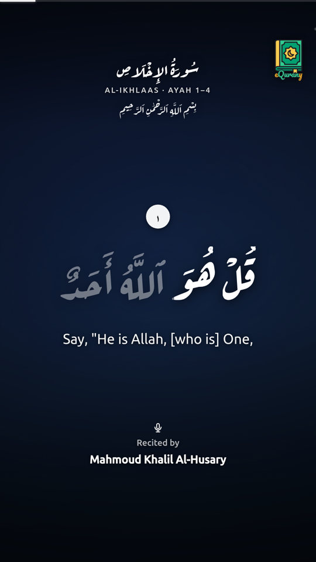
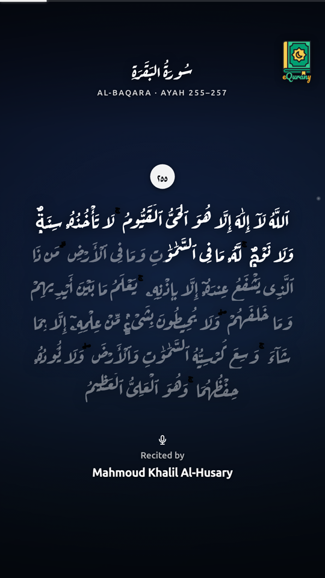
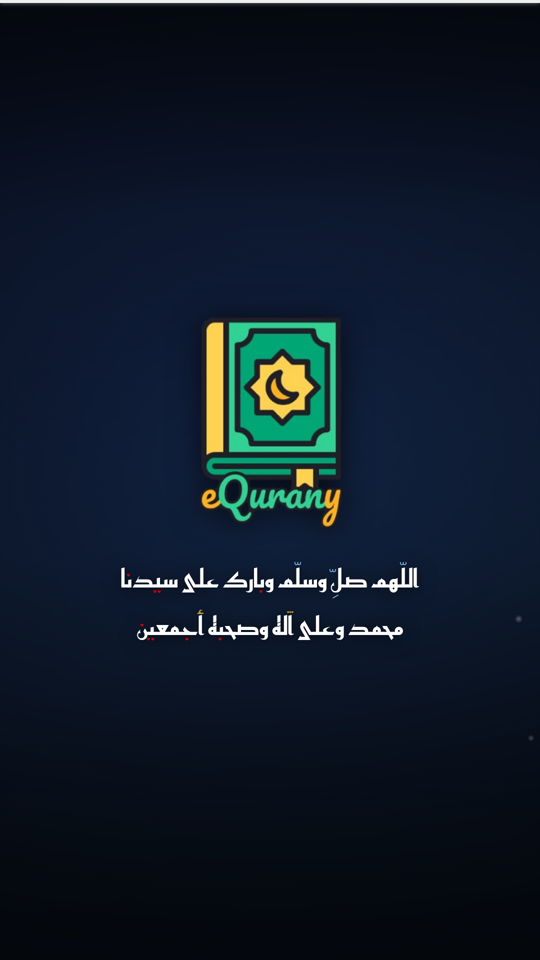

<div align="center">

# 🕌 Quran Poster

**Auto-generate cinematic, karaoke-synced Quran reels and publish them to TikTok, Instagram, Facebook & YouTube — on a schedule, hands-free.**

Pick nothing. A scheduler chooses a random surah + passage, pulls the exact recitation, renders a vertical video with word-by-word highlighting over a calm background, and posts it several times a day.

[](LICENSE)
[](package.json)
[](tsconfig.json)

**▶ See it live:** [@eQurany on TikTok](https://www.tiktok.com/@eQurany) — every video there is auto-generated by this project.

<table>
  <tr>
    <td></td>
    <td></td>
    <td></td>
  </tr>
</table>

</div>

---

## ✨ Features

- 🎬 **Cinematic 1080×1920 reels** — full-bleed stock photo background (Pexels/Unsplash) with a strong legibility overlay, subtle drifting particles, and a slow Ken-Burns drift.
- 🎤 **Karaoke word-fill** — each word brightens in sync with the recitation (right→left), so viewers follow along.
- 🖋️ **Authentic Arabic typography** — full Uthmani text with correct *shakl* in **Aref Ruqaa** calligraphy; translations in a clean sans.
- 🎯 **Exact sync, zero AI** — audio comes from [everyayah.com](https://everyayah.com) as per-ayah files, so each ayah's timing is exact and free (no transcription).
- 🔀 **Auto content selection** — random surah + a random consecutive passage (configurable length); short surahs render in full.
- 🌇 **Safe, tasteful backgrounds** — a curated 50-keyword pool (mosques, nature, sea, sky…) plus a filter that drops any photo containing people or anything unsuitable.
- 🎞️ **Signature outro** — the passage fades out and a ṣalawāt (with your logo) glides up over the same scene, then the whole video fades to black.
- 📤 **Multi-platform publishing** — TikTok, Instagram Reels, Facebook Reels and YouTube Shorts via [Buffer](https://buffer.com), toggled per platform by env.
- ⏰ **Set-and-forget scheduler** — an always-on process posts N times a day in your timezone.
- 🧹 **Disk-friendly** — local files are wiped right after posting; cloud objects are pruned automatically.
- 🐳 **One-container deploy** — Dockerfile + works great on Coolify, Fly, Railway, or any Docker host.

---

## 🧠 How it works

```
config / random pick
        │
        ▼
Quran text + translation  ──►  everyayah per-ayah audio (exact timing)
   (alquran.cloud)                       │
        │                                ▼
        └────────────►  TimedAyah[]  ──►  background (Pexels/Unsplash, person-filtered)
                                          │
                                          ▼
              Chromium renders animated frames (karaoke, particles, outro)
                                          │
                                          ▼
                    ffmpeg → MP4 (1080×1920) + recitation + silent outro
                                          │
                                          ▼
              object storage (public URL)  ──►  Buffer  ──►  TikTok / IG / FB / YT
                                          │
                                          ▼
                              cleanup (local now, cloud after ingest)
```

---

## 🚀 Quick start (local)

Requirements: **Node ≥ 20** and **ffmpeg** on your PATH. (Chromium is downloaded automatically by Puppeteer.)

```bash
git clone https://github.com/2O23/quran-poster.git
cd quran-poster
npm install
cp .env.example .env        # fill in what you need (see below)

# Render a specific passage to work/…/reel.mp4 (no publishing)
npm start render -- --surah 112 --from 1 --to 4 --reciter husary --translation en.sahih

# Render a random passage
npm start random

# Everything the CLI can do
npm start
```

The finished `reel.mp4` (plus the timed `ir.json`) lands in `work/<surah>_<range>_<reciter>__<tag>/`.

---

## ⚙️ Configuration

Everything is driven by environment variables (`.env`). All are optional except where a feature needs a key.

| Variable | Purpose | Default |
|---|---|---|
| `PEXELS_API_KEY` / `UNSPLASH_ACCESS_KEY` | Stock photo backgrounds | _(unset → gradient fallback)_ |
| `BUFFER_ACCESS_TOKEN` | Buffer API token for publishing | _(unset → no publishing)_ |
| `BUFFER_TIKTOK_CHANNEL_IDS` | Comma-separated TikTok channel ids | _(empty)_ |
| `BUFFER_INSTAGRAM_CHANNEL_IDS` | Instagram Reels channel ids | _(empty)_ |
| `BUFFER_FACEBOOK_CHANNEL_IDS` | Facebook Reels channel ids | _(empty)_ |
| `BUFFER_YOUTUBE_CHANNEL_IDS` | YouTube Shorts channel ids | _(empty)_ |
| `MINIO_*` | S3-compatible storage (public bucket Buffer fetches from) | bucket `quran-poster`, port `9000` |
| `TZ` / `PUBLISH_TIMES` | Timezone + times of day to auto-post | `Africa/Tunis` / `07:00,13:00,19:00` |
| `KARAOKE_ENABLED` | Word-by-word fill synced to recitation | `true` |
| `TEXT_FILL_COLOR` | Color of the recited (filled) text | `#ffffff` |
| `WATERMARK_ENABLED` / `WATERMARK_HANDLE` | Corner logo watermark (`assets/logo.png`) | `true` / _(empty)_ |
| `OUTRO_TEXT` | Outro sign-off text | a ṣalawāt |
| `FULL_SURAH_MAX_AYAHS` | Surahs this short render in full | `7` |
| `RANDOM_MIN_AYAHS` / `RANDOM_MAX_AYAHS` | Passage length for random mode | `5` / `10` |
| `RETENTION_DAYS` / `MINIO_RETENTION_HOURS` | Cleanup windows | `7` days / `24` h |
| `PORT` / `TRIGGER_TOKEN` | HTTP server + secret for the trigger endpoint | `3000` / _(unset → disabled)_ |

See [`.env.example`](.env.example) for the full annotated list.

**Reciters:** `husary`, `minshawy`, `abdulbasit`, `hudhaify`, `ayyoub`, `shuraym`, `husary-muallim` — or any raw [everyayah](https://everyayah.com) folder. See [`src/quran/reciters.ts`](src/quran/reciters.ts).

**Translations:** any [alquran.cloud](https://alquran.cloud) edition id, e.g. `en.sahih`, `fr.hamidullah`, or `""` for Arabic only.

---

## 📤 Publishing

Publishing goes through [Buffer](https://buffer.com), which fans out to every connected platform.

1. Create a Buffer account and connect your TikTok / Instagram / Facebook / YouTube channels.
2. Set `BUFFER_ACCESS_TOKEN`, then run `npm start channels` to list your channel ids.
3. Put the ids into the matching `BUFFER_*_CHANNEL_IDS` vars (any subset — TikTok only is fine).
4. `npm start random -- --publish` (or let the scheduler do it).

Each platform gets the right format automatically (Reel / Short). The caption includes the surah, ayah range, reciter, photo credit, and hashtags.

---

## 🐳 Deployment (always-on scheduler)

Build the container and run it anywhere Docker runs:

```bash
docker build -t quran-poster .
docker run -d --env-file .env quran-poster    # CMD is `serve`
```

`serve` starts:
- an **internal scheduler** that renders + publishes at every `PUBLISH_TIMES` in your `TZ`;
- a tiny **HTTP server** exposing `GET /health` and a secured **`GET /trigger?key=<TRIGGER_TOKEN>`** to fire a run on demand (great for testing). Add `&surah=2&from=255&to=257&reciter=husary` to pick a passage, or `&publish=false` to render only.

On **Coolify / Railway / Fly**: point it at this repo with the Dockerfile build pack, set the env vars, and deploy. That's it.

---

## 🗺️ Roadmap

- [ ] YouTube-source mode (yt-dlp + Whisper) for arbitrary recitations
- [ ] True forced-alignment karaoke (word-accurate) via Quran.com segments
- [ ] De-dup ledger so passages don't repeat until the Mushaf is cycled
- [ ] More layouts / themes

---

## 🙏 Credits

- Recitations: **[everyayah.com](https://everyayah.com)** · Text & translations: **[alquran.cloud](https://alquran.cloud)**
- Backgrounds: **[Pexels](https://pexels.com)** / **[Unsplash](https://unsplash.com)** (credited in every caption)
- Fonts: **Aref Ruqaa**, **Reem Kufi**, **Ubuntu** (SIL OFL / UFL)
- Rendering: **Puppeteer** + **ffmpeg**

## 📜 License

[MIT](LICENSE) — do good with it. Please keep recitations and Qur'anic text presented respectfully.

<div align="center">

_If this helps you spread a good word, ⭐ the repo and check out **[@eQurany](https://www.tiktok.com/@eQurany)**._

</div>
